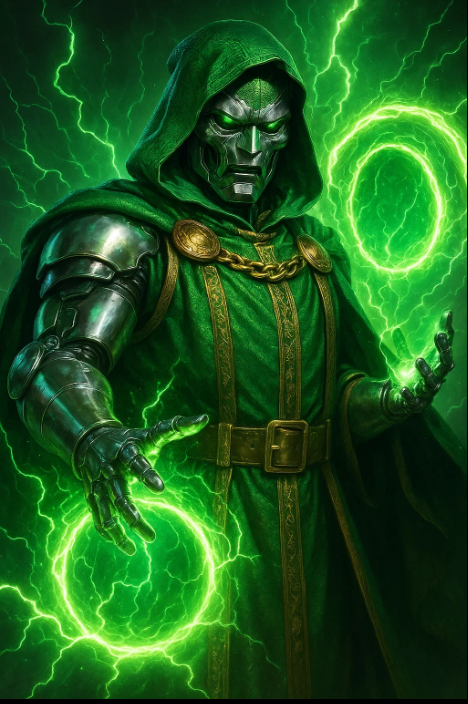

# DOOMSDAY: The Portal Awakens

A cinematic, hacker-themed cyber threat simulator built for front-end magic.

## 🚀 Features
- Dr. Doom style animated intro with voice
- Glowing portal transition
- Real-time attack map simulation
- Zero backend required

## 📦 How to Run
1. Open `index.html` to start the cinematic intro.
2. After the intro, you’ll be taken to the threat map.

## 🌐 Deploy on GitHub Pages
- Upload to GitHub
- Go to **Settings > Pages**
- Set source to **main branch**
- Visit `https://yourusername.github.io/your-repo`

## 🧠 Built With
- HTML, CSS, JS
- Leaflet.js for maps
- Voice + Typing simulated

